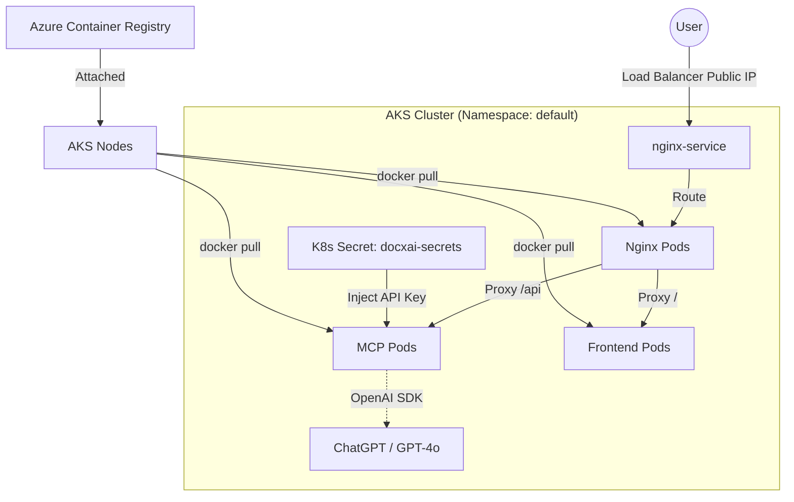

# Azure Kubernetes Service (AKS) Deployment Guide

This guide describes how to deploy the DocxAI solution (MCP, Frontend, and Nginx) to an AKS cluster. This setup is suitable for high-scale production environments requiring fine-grained control over container orchestration.

## Architecture



The deployment is managed by Kubernetes and consists of:

-   **MCP Deployment:** Python/FastAPI backend.
-   **Frontend Deployment:** React frontend.
-   **Nginx Deployment:** Gateway/Reverse proxy.
-   **Services:** Internal load balancing between components.
-   **Ingress/LoadBalancer:** External access via a public IP.

## Prerequisites

- [Azure CLI](https://learn.microsoft.com/en-us/cli/azure/install-azure-cli)
- [kubectl](https://kubernetes.io/docs/tasks/tools/)
- Docker installed and running
- An Azure subscription

## Quick Start (Automated Script)

```bash
chmod +x deploy-aks.sh
./deploy-aks.sh
```

## Manual Deployment Steps

### 1. Create AKS Cluster
Create a basic cluster and link it to your Azure Container Registry (ACR).

```bash
RESOURCE_GROUP="docxai-rg"
AKS_CLUSTER="docxai-cluster"
ACR_NAME="docxaicr"

# Create AKS Cluster (Dev/Test Tier)
az aks create \
    --resource-group $RESOURCE_GROUP \
    --name $AKS_CLUSTER \
    --node-count 2 \
    --generate-ssh-keys \
    --attach-acr $ACR_NAME \
    --vm-set-type VirtualMachineScaleSets \
    --load-balancer-sku standard \
    --node-vm-size Standard_B2ms
```

### 2. Get Credentials
```bash
az aks get-credentials --resource-group $RESOURCE_GROUP --name $AKS_CLUSTER
```

### 3. Create Secrets
Store your OpenAI API key as a Kubernetes secret:

```bash
kubectl create secret generic docxai-secrets --from-literal=OPENAI_API_KEY=your_api_key_here
```

### 4. Apply Manifests
Deploy the components using the provided YAML file:

```bash
kubectl apply -f k8s-deployment.yaml
```

### 5. Verify Deployment
Check the status of your pods and get the public IP of the Nginx service:

```bash
kubectl get pods
kubectl get service nginx-service
```

## Critical Notes
- **Static IP:** For production, it is recommended to use a reserved Static IP for the LoadBalancer.
- **Storage:** If you need persistent storage for uploads, you should configure a **PersistentVolumeClaim (PVC)** using Azure Disks or Azure Files.
- **Ingress Controller:** While this guide uses a simple LoadBalancer Service for Nginx, for more complex routing, you should install an **Ingress Controller** like `ingress-nginx` via Helm.
