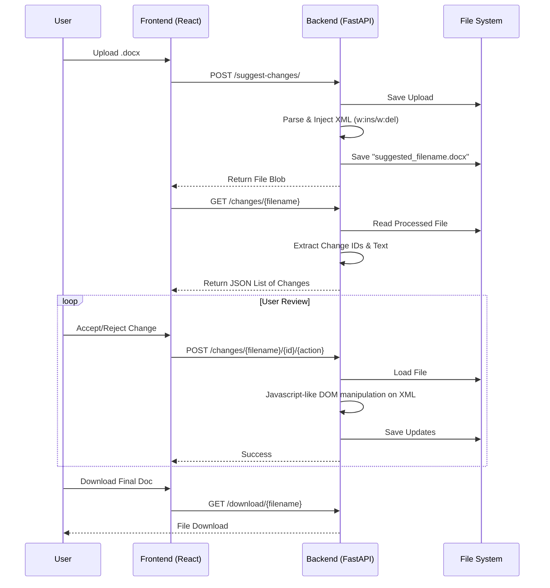

# 🤖 Docx AI Agent - Suggestion Engine

This project is an AI-powered assistant for improving Microsoft Word (`.docx`) documents. It scans your files, identifies areas for improvement (such as rephrasing, punctuation, and formatting), and inserts changes directly as **native Tracked Changes**.

This allows you to download the modified document and accept or reject suggestions using Microsoft Word's standard review tools, or interactively via our web interface.

## 🌟 Key Features

- **Automated Document Review**: The AI analyzes your text for clarity, tone, and correctness.
- **Native Tracked Changes**: Suggestions are inserted as specific `w:ins` (insertion) and `w:del` (deletion) XML tags, ensuring full compatibility with Word's "Track Changes" feature.
- **Interactive Web UI**: Review suggestions side-by-side, with "Accept" and "Reject" actions that modify the underlying document in real-time.
- **Downloadable Results**: Get your polished file with all unreviewed suggestions still tracked for offline review.

## 🔄 Application Flow



## 🛠️ Tech Stack

### Backend (`/backend`)
- **Framework**: [FastAPI](https://fastapi.tiangolo.com/) - High-performance Python API.
- **Document Processing**: `python-docx` with custom XML manipulation for revision tracking.
- **Dependency Management**: `uv` (or pip).

### Frontend (`/frontend`)
- **Framework**: [React 19](https://react.dev/) + [Vite](https://vitejs.dev/).
- **Styling**: CSS Modules/Standard CSS.
- **Icons**: [Lucide React](https://lucide.dev/).
- **HTTP Client**: Axios.

## 🚀 Getting Started

### Prerequisites
- Python 3.10+
- Node.js & npm/pnpm

### 1. Backend Setup
Navigate to the `backend` directory and install dependencies:

```bash
cd backend
# Using uv (recommended)
uv pi install -r requirements.txt # or just sync if using uv.lock
# Or using pip
pip install -r requirements.txt
```

Start the API server:

```bash
uvicorn main:app --reload
# Server running at http://localhost:8000
```

### 2. Frontend Setup
Navigate to the `frontend` directory:

```bash
cd frontend
npm install # or pnpm install
```

Start the development server:

```bash
npm run dev
# App running at http://localhost:5173
```

## 📖 Usage Guide

1.  Open the web application (`http://localhost:5173`).
2.  Click **Upload** to select your `.docx` file.
3.  Wait for the AI to process the document.
4.  Review the suggestions in the right-hand panel:
    -   **Accept**: Permanently applies the change.
    -   **Reject**: Discards the suggestion and restores original text.
5.  Click **Download** to save the updated file.

## 📂 Project Structure

```
Docx-AI-Agent/
├── backend/            # Python API
│   ├── main.py         # App entry point & logic
│   └── uploads/        # Temporary storage
├── frontend/           # React App
│   ├── src/            # Components & Logic
│   └── public/         # Static assets
└── .agent/             # Agent configuration & Skills
```
