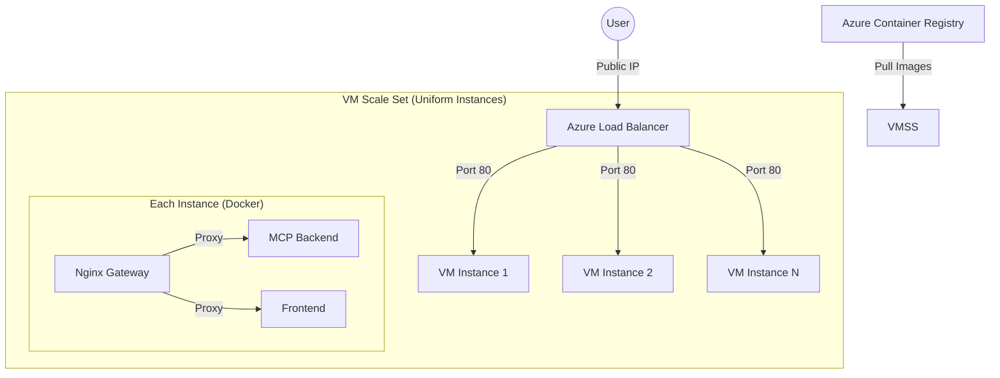

# 🚀 Azure VM Scale Set (VMSS) Deployment Guide

This guide describes how to deploy the DocxAI solution on an **Azure Virtual Machine Scale Set (VMSS)**. This approach combines the control of Virtual Machines with the auto-scaling capabilities of cloud-native services.

## Architecture



## 1. Create the Scale Set

You can create a VMSS via the Azure CLI. We will use a "Uniform" orchestration mode for identical instances.

```bash
RESOURCE_GROUP="docxai-rg"
VMSS_NAME="docxai-vmss"
LOCATION="westeurope"

# Create VMSS with 2 initial instances
az vmss create \
  --resource-group $RESOURCE_GROUP \
  --name $VMSS_NAME \
  --image Ubuntu2204 \
  --vm-sku Standard_B2ms \
  --instance-count 2 \
  --admin-username azureuser \
  --generate-ssh-keys \
  --upgrade-policy-mode Automatic \
  --lb-sku Standard \
  --public-ip-address docxai-vmss-ip
```

## 2. Configure Auto-Scaling Rules

Define when Azure should add or remove instances. For example, add an instance when CPU > 75% and remove when CPU < 25%.

```bash
# Add scale-out rule (CPU > 75%)
az monitor autoscale create \
  --resource-group $RESOURCE_GROUP \
  --resource $VMSS_NAME \
  --resource-type Microsoft.Compute/virtualMachineScaleSets \
  --name docxai-cpu-autoscale \
  --min-count 1 \
  --max-count 10 \
  --count 2

az monitor autoscale rule create \
  --resource-group $RESOURCE_GROUP \
  --autoscale-name docxai-cpu-autoscale \
  --condition "Percentage CPU > 75 avg 5m" \
  --scale out 1
```

## 3. Provisioning the Application

Unlike a single VM, you shouldn't SSH into each instance to install Docker. Instead, use a **Custom Script Extension** or a **cloud-init** file to install Docker and start the containers automatically when a new instance is born.

### Option A: Cloud-Init (Recommended)
Create a `cloud-config.yaml` file that Azure uses to setup every new VM in the set.

```yaml
#cloud-config
package_upgrade: true
packages:
  - docker.io
  - docker-compose
runcmd:
  - systemctl enable docker
  - systemctl start docker
  - usermod -aG docker azureuser
  # Pull your code and start the stack
  - git clone https://github.com/your-repo/DocxAI.git /opt/docxai
  - cd /opt/docxai && docker-compose -f docker-compose-azure.yml up -d
```

Apply to the VMSS:
```bash
az vmss update \
  --resource-group $RESOURCE_GROUP \
  --name $VMSS_NAME \
  --set virtualMachineProfile.osProfile.customData=$(base64 -w0 cloud-config.yaml)
```

## Pros & Cons

| Pros | Cons |
| :--- | :--- |
| **Native Auto-scaling**: Scales with traffic automatically. | **State Management**: You cannot store files on the local VM disk (use Azure Files). |
| **High Availability**: Instances spread across hardware racks. | **Configuration Complexity**: Requires automation (cloud-init/Terraform). |
| **Standardized Fleet**: Every instance is a carbon copy, reducing config drift. | **Image Updates**: Updating code requires re-imaging or script execution. |
