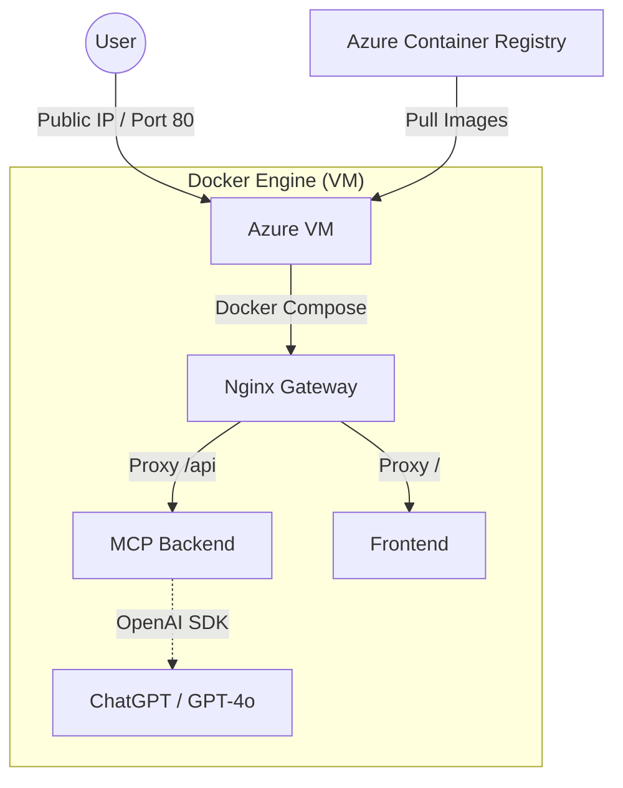

# 🖥️ Azure Virtual Machine (VM) Deployment Guide

This guide describes how to deploy the DocxAI solution on a dedicated Azure Virtual Machine using Docker Compose. This is an **Infrastructure as a Service (IaaS)** approach, providing maximum control over the environment.

## Architecture



## Prerequisites

- [Azure CLI](https://learn.microsoft.com/en-us/cli/azure/install-azure-cli)
- An Azure subscription
- SSH client (like Terminal or PuTTY)

## 1. Create the Virtual Machine

You can create a VM via the Azure Portal or CLI. A **Standard_B2ms** (2 vCPUs, 8GB RAM) is recommended for best performance.

```bash
RESOURCE_GROUP="docxai-rg"
VM_NAME="docxai-vm"
LOCATION="westeurope"

# Create Resource Group
az group create --name $RESOURCE_GROUP --location $LOCATION

# Create VM (Ubuntu 22.04)
az vm create \
  --resource-group $RESOURCE_GROUP \
  --name $VM_NAME \
  --image Ubuntu2204 \
  --admin-username azureuser \
  --generate-ssh-keys \
  --public-ip-sku Standard \
  --size Standard_B2ms
```

## 2. Configure Networking (Firewall)

Open port 80 (HTTP) to allow traffic to the Nginx gateway.

```bash
az vm open-port --resource-group $RESOURCE_GROUP --name $VM_NAME --port 80 --priority 101
```

## 3. Setup the VM Environment

SSH into your VM and install Docker.

```bash
# Get the IP address
IP_ADDRESS=$(az vm show -d -g $RESOURCE_GROUP -n $VM_NAME --query publicIps -o tsv)
ssh azureuser@$IP_ADDRESS

# Run inside VM:
sudo apt-get update
sudo apt-get install -y docker.io docker-compose
sudo usermod -aG docker azureuser
exit
```

## 4. Deploy the Application

1. **Upload Configuration**: Copy `docker-compose-azure.yml` and `nginx.conf` to the VM.
2. **Set Environment Variables**: Create a `.env` file on the VM.
3. **Pull and Run**:

```bash
# On your local machine (copy files)
scp docker-compose-azure.yml nginx.conf azureuser@$IP_ADDRESS:~/

# SSH back in
ssh azureuser@$IP_ADDRESS

# Create .env
echo "OPENAI_API_KEY=your_key_here" > .env
echo "DOCKER_REGISTRY=docxaicr.azurecr.io" >> .env

# Login to ACR (if using private images)
docker login docxaicr.azurecr.io

# Start the app
docker-compose -f docker-compose-azure.yml up -d
```

## Pros & Cons

| Pros | Cons |
| :--- | :--- |
| **Full Control**: Total access to the OS and runtime. | **Management Overhead**: You handle OS updates and security patches. |
| **Predictable Cost**: Fixed monthly price regardless of traffic. | **No Auto-scaling**: Manual vertical or horizontal scaling required. |
| **Flexibility**: Can run other tools (databases, caches) on the same machine. | **Manual Networking**: Must manage firewall rules and certificates manually. |
